# Command Line Interfaces and Scripting: Lab 1

## Question 1

You have just joined IxD Systems as a junior systems engineer. On your first day, the Linux administrator asks you to perform a basic environment verification on the lab machine using your own login account.

1. User Identity Verification

Display your currently logged-in username and all groups your user account belongs to.

Your name or login ID must appear in the output.
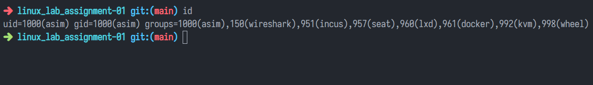

2. Workspace Validation

Display the current working directory and list all files and directories in that location using long format listing.
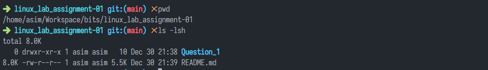

3. Environment Confirmation File

Create a file named user_info.txt and write the line:

&quot;Linux user environment verified&quot;

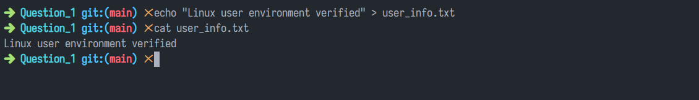 4. File Integrity Check

Display the number of characters present in user_info.txt.
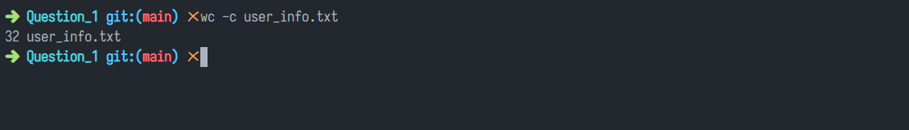 5. Learning the Tools

Access the manual page of the mkdir command. Identify one useful option and briefly explain what it does.
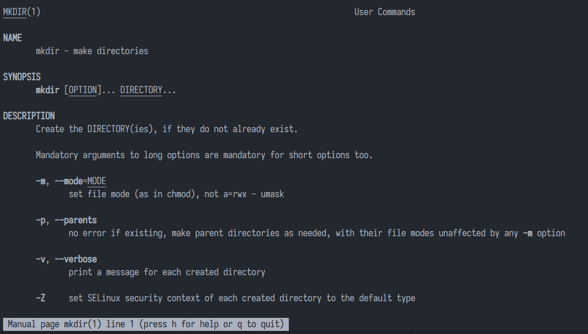

`--parents` option is useful while creating multiple level nested ditrectories.

6. Home Directory Inspection

List the contents of your home directory sorted alphabetically.
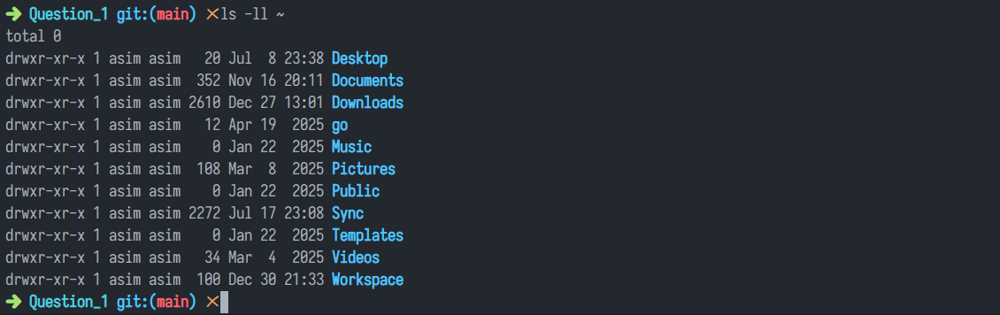

7. Log Investigation

Search for the word &quot;admin&quot; inside a file named log.txt and display only the matching lines.

8. System Information Check

Display the Linux kernel version currently running.
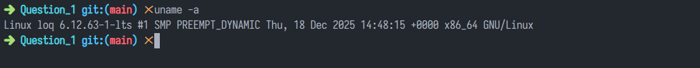

9. Network Connectivity Test

Verify network connectivity by sending ICMP packets to www.google.com.
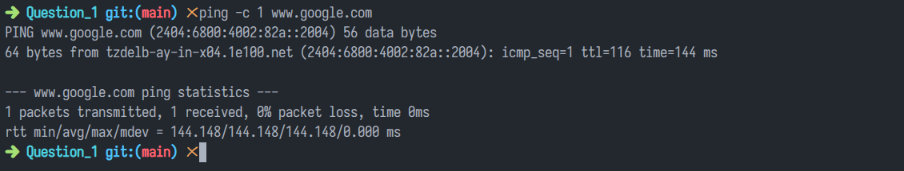

10. System Health Awareness

Display the command used to check system uptime and briefly explain its output (uptime duration, number of users, load average).

- `21:50:26` - at this time
- `up 18 min` - system is up for 18 minute
- `1 user` - there is 1 logged in user
- `load average: 0.18, 0.40, 0.36` - cpu load over 1, 5 and 15 minutes respectavely

## Question 2

You are working as a junior system administrator responsible for organizing project- related files in your home directory.

Your supervisor wants you to demonstrate your understanding of Linux file and directory management commands.

1. Project Workspace Setup

Create a directory named documents inside your home directory. This directory will store your project-related files.
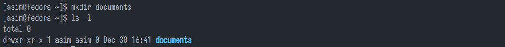

2. File Creation

Navigate into the documents directory and create a file named plan.txt.
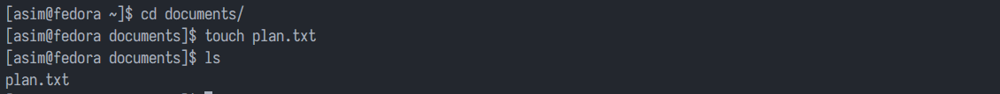

3. Content Addition

Write some sample text of your choice into the plan.txt file. The content can be a short project note or reminder.
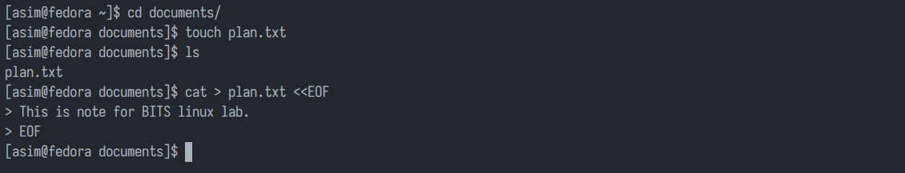

4. File Metadata Verification

Display the permissions and ownership details of the plan.txt file. Ensure your username appears in the output.
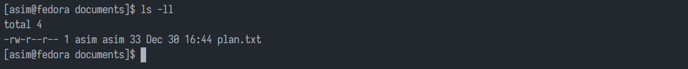

5. File Duplication

Create a copy of plan.txt and name it plan_copy.txt.
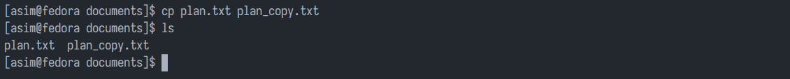

6. Directory Renaming

Rename the documents directory to project_documents to reflect the project scope more clearly.
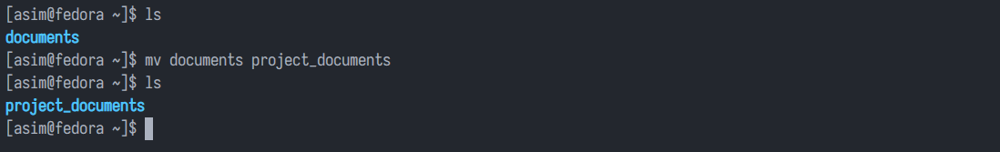

7. Archival Structure

Inside the project_documents directory, create a subdirectory named archive.
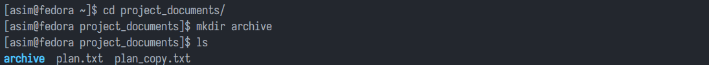

8. File Organization

Move plan_copy.txt into the archive subdirectory.
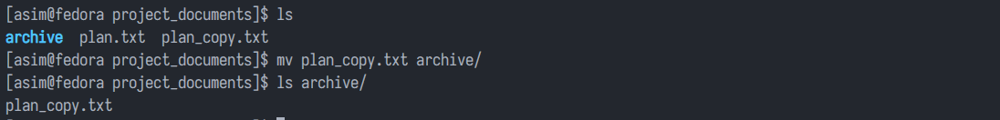

9. Recursive Listing

List all files and subdirectories inside project_documents recursively so that the complete directory structure is visible.
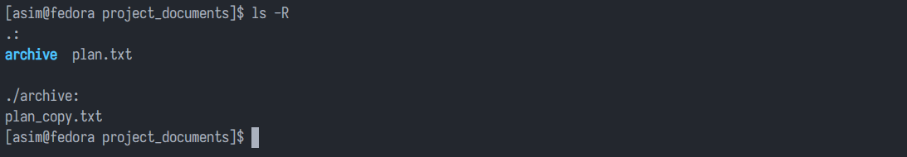

10. Path Verification

Display the absolute path of the plan_copy.txt file after it has been moved to the archive directory.
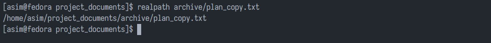

## Question 3

You have been asked to understand how Linux manages files using links and disk usage information.As part of your role, you will perform the following operations within your own user space.

1. File Creation

Create a file named sample_data.txt in your home directory and add some sample text to it.
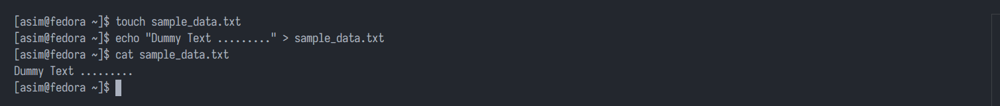

2. Hard Link Creation

Create a hard link to sample_data.txt named sample_hard.txt.
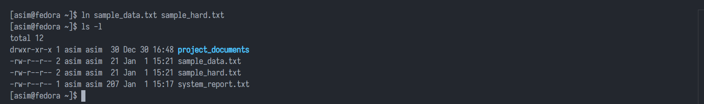

3. Symbolic Link Creation

Create a symbolic (soft) link to sample_data.txt named sample_soft.txt.
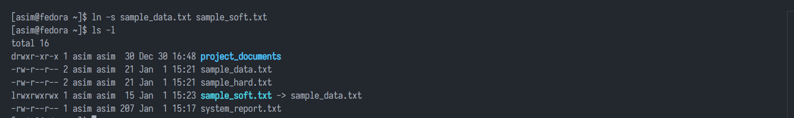

4. Inode Verification

Display the inode numbers of sample_data.txt, sample_hard.txt, and sample_soft.txt.
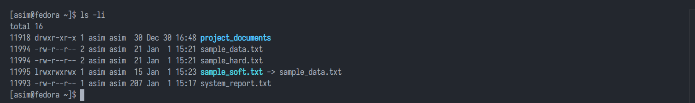

5. Inode Analysis

Identify which files share the same inode number and briefly explain the reason.

`sample_hard.txt` and `sample_data.txt` shares same inode as it is same for hard links.

6. File Metadata Inspection

Display detailed file information (permissions, ownership, size, timestamps) of sample_data.txt.
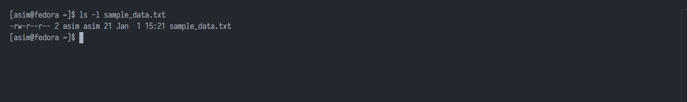

7. Disk Usage Check

Display the disk usage of your home directory in a human-readable format.
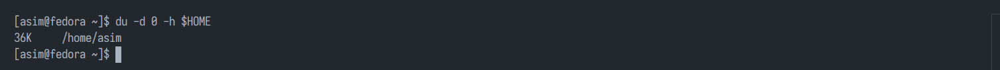

8. File Size Overview

Display the size of each file present in your home directory in a human-readable format.
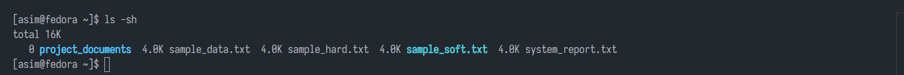

9. Link Deletion Test

Delete the symbolic link sample_soft.txt and verify that the original file sample_data.txt is unaffected.
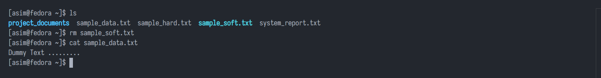

10. Disk Utility Demonstration

Demonstrate the usage of du and df commands using various useful options and briefly explain the output.
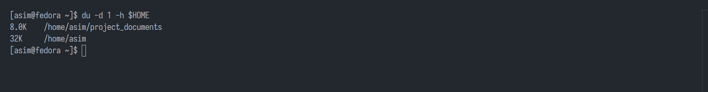
`-d 1` for scan depth, `-h` for human readable sizes. Using `$HOME` as positional argument to limit scan to `/home/asim`.

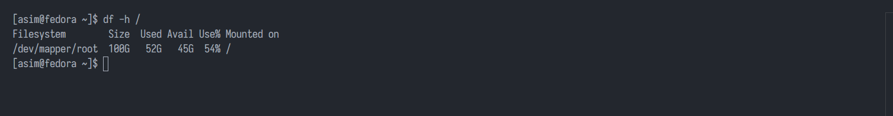

`-h` for human readable size, and only displaying the information for `/` mount point by using the positional argument.

## Question 4

You must perform all operations without making any configuration changes to the system.

These tasks should be executed within your own user account. Since uptime, processes, memory usage,disk usage, and background jobs vary across systems and users, each student’s output will be unique.

1. System Uptime Verification

Display the time elapsed since the system was last booted.
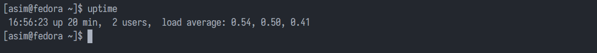

2. User Process Listing

List all processes currently running under your user account.
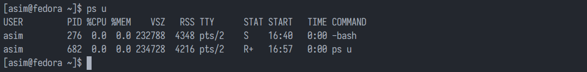

3. CPU Usage Analysis

Identify the process that is consuming the highest CPU usage among your running processes.

4. Background Process Execution

Start a command in the background and verify that it is running.
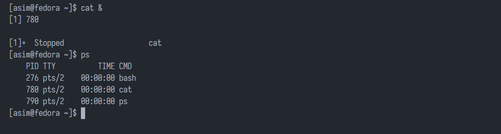

5. Process Priority Management

Change the priority (niceness) of one of your running processes and display the updated priority.
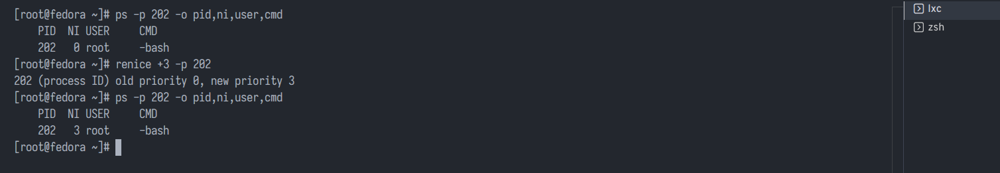

6. Memory Usage Monitoring

Display memory usage information in a human-readable format.
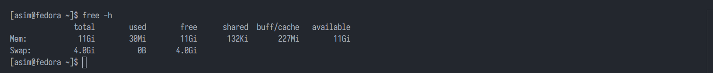

7. Disk Space Inspection

Display the disk space usage of the filesystem where your home directory resides.
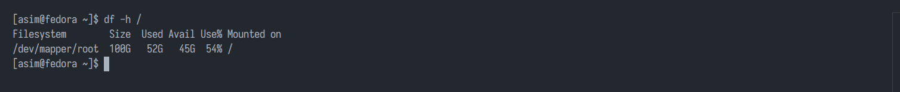

8. Shell Identification

Display the name of the shell currently in use.
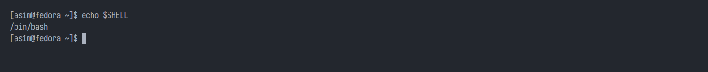

9. Output Redirection

Redirect the output of a system information command of your choice into a file named system_report.txt.
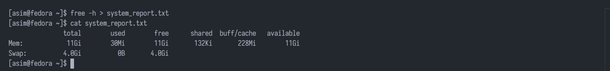

10. Disk Usage Visualization

Demonstrate the usage of the ncdu tool using appropriate options and briefly explain what it shows.
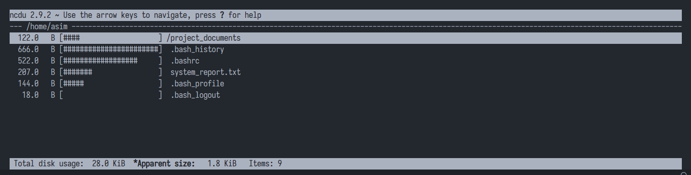
